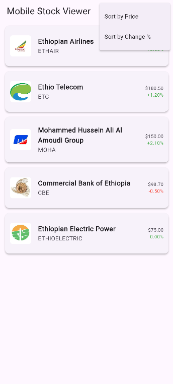
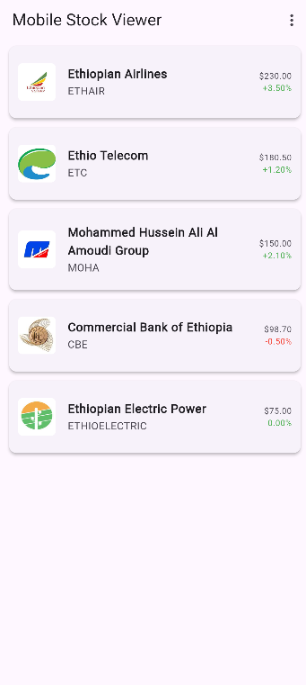
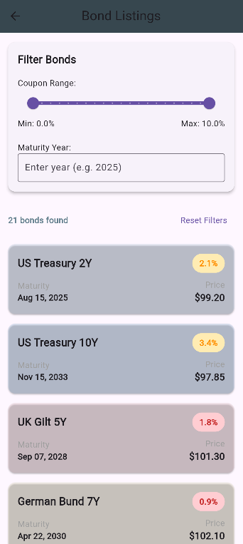

# 📊 Stocet - Stock, Bond & CMSP Explorer

**Stocet** is a Flutter mobile app designed to help users explore key elements of Ethiopia’s capital market: **Stocks**, **Bonds**, and **Capital Market Service Providers (CMSPs)**.

Built with 💙 Flutter and ⚙️ Riverpod, this app is modular, cleanly structured, and fully offline using mock data.

---

## ✅ Features

- 📈 **Stock List Page** – View and sort Ethiopian stocks by performance.
- 💵 **Bond List Page** – Explore bonds with coupon rate and maturity filters.
- 🏢 **CMSP Explorer** – Discover registered capital market service providers with detailed educational profiles.
- 🌗 Built-in light/dark support (WIP).
- 💻 Works fully offline with local JSON data.

---

## 📸 Screenshots

### 1️⃣ Task 1: Stock Sorting & Viewing

- ✅ Sorted stock list with performance data




---

### 2️⃣ Task 2: Bond List Filter

- ✅ Browse bonds by coupon rate and maturity



---

### 3️⃣ Task 3: CMSP Explorer

- ✅ List and detail view for Ethiopian Capital Market Service Providers (CMSPs)


---

## 🗂 Folder Structure

```bash
lib/
├── main.dart
├── models/           # Data models (Stock, Bond, CMSP)
├── providers/        # Riverpod providers
├── screens/          # All pages (Stock, Bond, CMSP)
├── widgets/          # Reusable UI components
└── assets/
    └── data/         # Local mock JSON files
    └── screenshots/  # App screenshots
